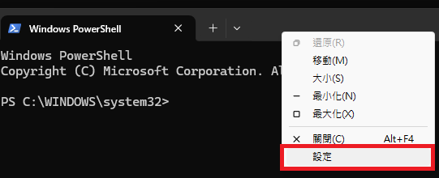
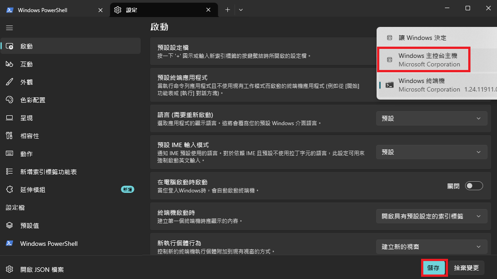
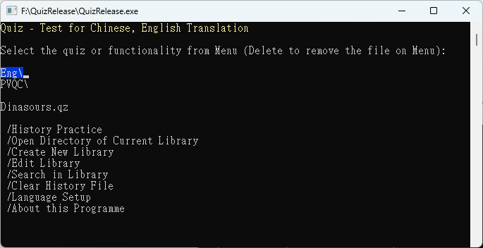

# Bill English Vocabulary Quiz Program

A console-based self-improvement quiz programme for practicing English vocabulary, built for Windows in C++.

Written by Bill Tsou (National Ilan University) in 2018 to help study for PVQC, and updated
since January 2026 with a directory-based vocabulary library system.

## Features

- Interactive vocabulary quizzes: type the answer letter-by-letter with live feedback, choose how many
  questions to attempt each round.
- Vocabulary libraries organized as a browsable folder tree under `database\`.
- Search across every library file in `database\` for a keyword (English or Chinese) and optionally
  save the results as a new library.
- Create and edit libraries directly (opens Notepad, then converts the `.txt` draft into a `.qz` library).
- Automatic history tracking: wrong answers are saved to `[History].qzc` and can be re-practiced later.
- Traditional Chinese / English UI, switchable from the in-programme menu.

## Requirements

- Windows (the programme uses `<windows.h>` console and GDI APIs, so it will not build or run on other
  platforms).
- A MinGW-w64 `g++` and `windres` toolchain. This project is developed with the toolchain bundled with
  [Dev-C++](https://github.com/Embarcadero/Dev-Cpp) (tested with Dev-C++ 5.11 / MinGW64), installed by
  default at:
  ```
  C:\Program Files (x86)\Dev-Cpp\MinGW64\bin
  ```
  Any other MinGW-w64 `g++`/`windres` on your `PATH` will also work.

## Project Structure

| Filename | Description |
| --- | --- |
| `QuizRelease.cpp` | Program entry point / main menu loop |
| `QuizCommon.h`/`.cpp` | Shared logic: menus, file I/O, quiz flow, search, history |
| `Menu.h`/`.cpp` | Console menu widget (arrow-key navigation, colours) |
| `CreativeCommons.h`/`.cpp` | "About" dialog (Win32 dialog + bitmap) |
| `database\` | Vocabulary libraries (`*.qz`), organized in sub-folders |
| `compile.bat` | Build / clean helper script |
| `[Quiz].set` | Saved UI language setting (auto-created) |
| `[History].qzc` | Saved history of incorrectly-answered questions (auto-created) |

## Compiling

Use the included `compile.bat` from a Command Prompt in the project root:

```bat
compile.bat compile
```

This compiles all source files, links `windres`-compiled resources (icon/bitmap), and produces
`QuizRelease.exe` in the project root. Intermediate `.o`/`.res` files are left in place after a build.

## Cleaning

```bat
compile.bat clean
```

Removes the intermediate `.o` and `.res` files produced by `compile.bat compile`, without touching
`QuizRelease.exe`.

## Running

To navigate menu items correctly with arrow keys, set up terminal as `Windows Console` first.





Run the built executable from the project root (it reads/writes `database\`, `[Quiz].set`, and
`[History].qzc` relative to the current directory):

```bat
QuizRelease.exe
```

Navigate the menu with the arrow keys and Enter; press `Delete` on a library file to remove it from the
menu. The first run will set up `database\` and `[Quiz].set` automatically if they don't already exist.

Demo screenshot of Quiz program



## Library File Format

Each library is a plain-text `.qz` file under `database\` (in any sub-folder), one vocabulary entry per
line, in the form:

```
english_word=chinese_definition
```

For example:

```
appointment=n.約會，約定
calendar=n.日曆/月曆/行事曆
```

Libraries can be created/edited from the in-programme menu (`Create New Library` / `Edit Library`), which
opens the file in Notepad for editing and converts it back into `.qz` format automatically.

## Developer References

Refer to the following picture for console text color codes of function `ChangeColour`.


